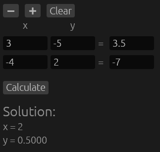
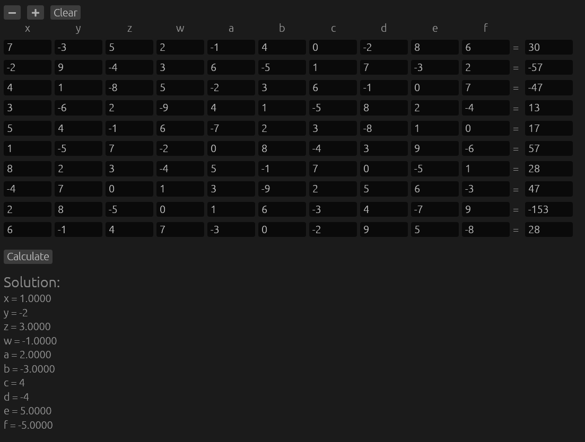

# Linear Systems Solver

A simple, GUI-based linear system solver built with Rust and egui.

## Previews

### 2x2 Matrix Solver


### 10x10 Matrix Solver


## How to run
Make sure you have Rust installed, then run:
```bash
cargo run --release
```
